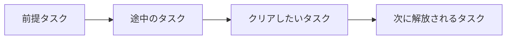

# Tarkov Helper

**「このタスクをクリアしたい。まず何をやればいい？」を、グラフでたどれるタスク管理アプリ。**

[](https://github.com/ApfelTKSG/tarkov-helper/actions/workflows/deploy.yml)
[](LICENSE)

[**アプリを開く**](https://apfeltksg.github.io/tarkov-helper/) · [不具合報告・機能の提案](https://github.com/ApfelTKSG/tarkov-helper/issues) · [データ更新の仕組み](docs/DATA_PIPELINE.md)

## なぜグラフなのか

Escape from Tarkovでは、目的のタスクを見つけても「その前に何をクリアすればいいのか」が分かりにくいことがあります。タスクが縦に並ぶ一覧では、前提・後続タスクを行き来しながら関係を確認する必要があります。

Tarkov Helperは、タスクと依存関係を**左から右へつながるグラフ**で表示します。気になるタスクにカーソルを合わせるだけで、そこへ至る前提タスクと、その先に続くタスクをまとめてハイライト。完了を記録するだけでなく、**次に進めるタスクを見つけるための見取り図**として使えます。



_図は依存関係の表示イメージです。実際の解放条件には、PMCレベルやトレーダーのLLなども含まれます。_

## 主な機能

| 機能             | できること                                                                        |
| ---------------- | --------------------------------------------------------------------------------- |
| タスクグラフ     | 前提・後続タスクをハイライトし、つながりの深さに沿って表示                        |
| トレーダー別表示 | つながるタスクラインと、単独タスクのLL別表示を分けて整理                          |
| 全トレーダー表示 | トレーダーをまたいでつながるタスクラインをまとめて確認                            |
| 解放条件の確認   | PMCレベル・LL・信頼度・前提タスクなどから受注可否を判定。不明な条件は「要確認」に |
| 進捗の記録       | ノードから完了・取り消しを操作。タスクによる信頼度の増減も反映                    |
| FiR・Collector   | 必要アイテムを画像で確認し、確保数を記録                                          |
| レイド準備       | マップを選び、受注中タスクの未達目標やキー・マーカーの候補を確認                  |
| プロフィール     | 通常・PvE・シーズンの進捗を分けて保存。プレステージに応じたNew Beginningも表示    |
| バックアップ     | 進捗の書き出し・復元、データ版の固定、セルフワイプに対応                          |

日英のタスク名・アイテム名・IDで検索でき、お気に入りのタスクは星と金色の枠で強調します。

## 使い方

1. [アプリ](https://apfeltksg.github.io/tarkov-helper/)を開き、ゲームモード・PMCレベル・プレステージなどを設定します。
2. トレーダーを選び、進めたいタスクを検索します。
3. ノードにカーソルを合わせて前提・後続を確認し、必要なタスクを進めます。

| グラフの操作                      | 動作                               |
| --------------------------------- | ---------------------------------- |
| カーソルを合わせる                | 前提・後続タスクと経路をハイライト |
| 左クリック                        | 完了を記録／取り消し               |
| Shift＋クリック、または右クリック | 詳細をポップアップで表示           |
| 背景をドラッグ／ホイール          | 移動／拡大・縮小                   |

半透明のノードは通常クリックで完了できません。詳細から条件を確認してください。条件を自動判定できるタスクは「条件自動判定／条件を無視して受注可能にする」、要確認タスクは「ゲーム内に出ていない／出ている」を選べます。

## 保存とデータについて

- 進捗はブラウザ内に保存されます。ゲームと自動同期はしません。端末を変えるときやブラウザの保存データを消す前に、バックアップを書き出してください。
- ゲームデータは6時間ごとに更新を確認し、変更を検出した場合は検証して反映する仕組みです。取得・検証に失敗した場合は既存データを保持します。
- 未解明の内部条件など、完全に判定できない条件は「要確認」として残します。実際にゲーム内で表示されたかを記録できます。
- ハイドアウトページは現在無効です。上部のボタンは灰色で表示されます。

データの取得元：

- [tarkov.dev API / The Hideout](https://github.com/the-hideout/tarkov-api) — タスク・アイテム・トレーダーなどのゲームデータ
- [tarkov-data-overlay / TarkovTracker.org](https://github.com/tarkovtracker-org/tarkov-data-overlay) — LL分類・タスク配布グループ・一部のプレステージタスクなどの補足データ

詳しくは[データ更新手順](docs/DATA_PIPELINE.md)を参照してください。

## ローカルで動かす

Node.js 24を使用します。Next.js・React・TypeScript・React Flowで構成され、GitHub Pages向けに静的出力します。

```sh
npm ci
npm run dev
```

[http://localhost:3000](http://localhost:3000)を開いてください。ゲームデータはリポジトリに含まれているため、起動前に取得する必要はありません。

変更を確認する場合：

```sh
npm test
npm run lint
npm run typecheck
npm run build
```

ゲームデータを手動で更新する場合：

```sh
npm run data:update
```

## License

[GNU General Public License v3.0 or later](LICENSE)。

ゲームデータの取得元である[tarkov-api](https://github.com/the-hideout/tarkov-api)はGPL-3.0、補足データの[tarkov-data-overlay](https://github.com/tarkovtracker-org/tarkov-data-overlay)はMITライセンスです。[補足データのライセンス通知](docs/TARKOV_DATA_OVERLAY_LICENSE.txt)を同梱しています。
